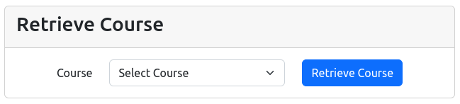
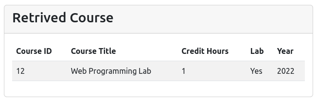
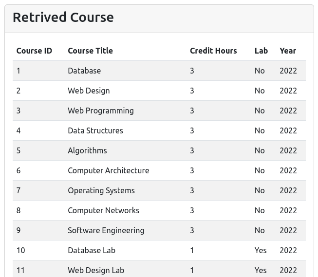

# Educational Projects Repository

This repository contains a collection of educational projects that I have worked on. The projects are organized by language and are listed below.

<!-- Table of Contents -->

## Table of Contents

<!-- for frontend, backend main categories and then by languages -->

- [Educational Projects Repository](#educational-projects-repository)
  - [Table of Contents](#table-of-contents)
  - [Frontend](#frontend)
    - [HTML, CSS, JavaScript](#html-css-javascript)
  - [Backend](#backend)
    - [PHP, MySQL](#php-mysql)
      - [Course Retriever from Database using PHP and MySQL](#course-retriever-from-database-using-php-and-mysql)

## Frontend

### HTML, CSS, JavaScript

## Backend

### PHP, MySQL

#### Course Retriever from Database using PHP and MySQL

This project is a simple course retriever from a database using PHP and MySQL. The project is a simple web application that allows the user to retrieve courses from a database.

Course Retrieval Form

Single Course:

All Courses:

